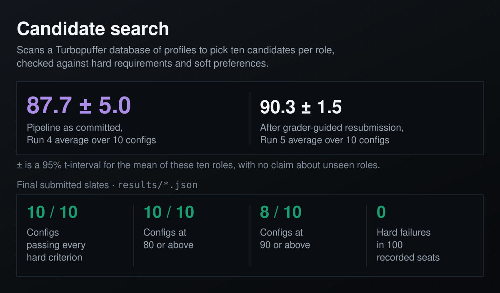
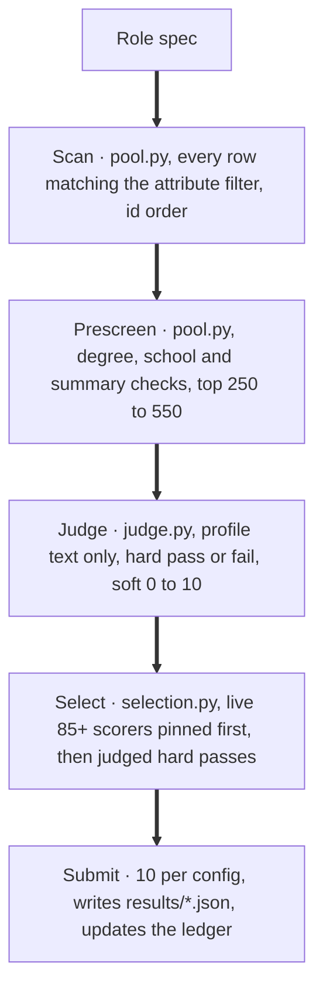
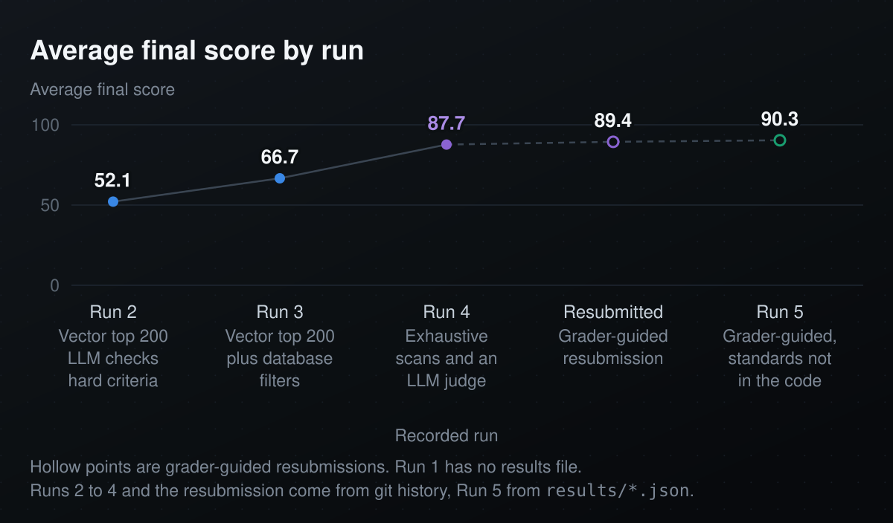
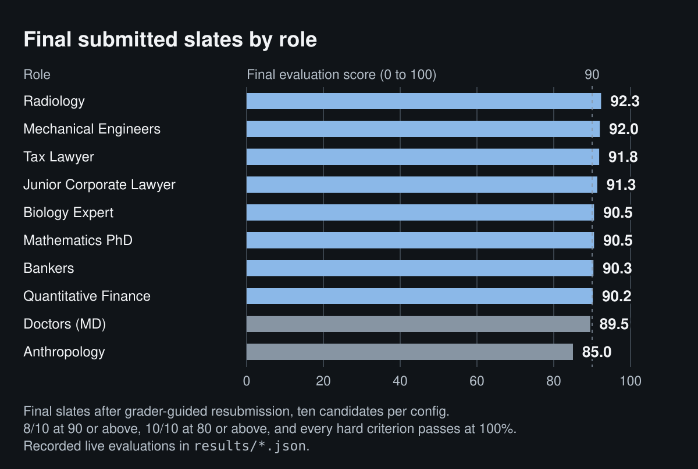

<p align="center">
  
</p>

<div align="center">

<h1>Candidate Search with Attribute-Filtered Scans and an LLM Judge</h1>

<br/>


<br/><br/>

<strong>Ten hiring searches over a Turbopuffer database of candidate profiles, each slate scored by a live grader.</strong><br/>
The pipeline as committed recorded an 87.7 average, and resubmitting with the grader's feedback took the final slates to 90.3.

<br/>

Scan the database, prescreen, judge each candidate, then select ten and submit.

</div>

---

## The Problem

I had a vector database of candidate profiles and ten role specs, each with hard requirements (a JD degree, 3+ years of experience) and soft preferences (IRS audit exposure, legal writing). Ranking by embedding similarity alone mixes the two and returns candidates who read close to the role but miss a hard requirement outright.

## What This Does

The Run 4 pipeline is three scripts, run one config at a time. None of them embeds anything or runs a vector query.

1. `pool.py` scans each config's hard-gate population exhaustively. The config's Turbopuffer attribute filter (degree type, field of study, or country) defines the population, and the scan pages through every matching row in id order.
2. `pool.py` then cuts that population to a pool. Five configs first check parsed degree entries for a school requirement before full records are fetched. Doctors need an elite-school MD, Mathematics and Biology a bachelor's from the U.S., U.K. or Canada, Quantitative Finance an M7 MBA, and Bankers a U.S. MBA. Every config then keeps the candidates who pass a per-role check on degree entries, summary text, or both, ranks them by keyword counts in the summary, and keeps the top 250 to 550, depending on the role. The scan returns every row that matches the attribute filter, and these school lists, keyword checks and caps can drop qualified candidates after it.
3. `judge.py` scores every pooled candidate on its own, one candidate per call. It reads only the profile text (`rerankSummary`), which is what I assume the grader reads, adds per-config calibration notes drawn from earlier verdicts, and never sees a live score. Each hard criterion passes or fails, each soft criterion gets 0 to 10, and the predicted score is 0 on any hard failure, otherwise the soft mean times ten. The model is GPT-4o-mini unless `JUDGE_MODEL` names another.
4. `selection.py` picks the ten to submit, and the grader's earlier verdicts come first. It keeps a per-config ledger of every submission, seeded from the recorded `results/<config>.json`. Anyone the grader hard-failed is out for good, and IDs named with `--exclude` are left out of that run. Anyone the grader already scored 85 or above (the `PIN_MIN` default) is pinned first, IDs named with `--include` come next, and judged candidates who pass every hard criterion fill the remaining seats in order of predicted score. Pinned and `--include` candidates skip the local hard-criteria check. It submits the ten to the evaluation endpoint, writes `results/<config>.json`, archives the response, and folds each outcome back into the ledger.

`main.py` still runs the original vector pipeline as it stood at Run 3, with a Voyage-3 query embedding, a Turbopuffer ANN top 200, Python filters, and GPT-4o-mini reranking in batches of five. It produced none of the Run 4 and Run 5 results.

## Architecture

<p align="center">
  
</p>

<details>
<summary>Graph source, for agents and tooling</summary>



</details>

### Stage details

| Stage | What | Candidates |
|---|---|---|
| Scan | `pool.py` pages through every row matching the config's Turbopuffer attribute filter, in id order | Every matching row (scan sizes are not recorded) |
| Prescreen | `pool.py` checks parsed degree entries (5 configs), then degree entries, summary text, or both per role, and ranks by keyword counts | Top 250 to 550 per config |
| Judge | `judge.py` scores each pooled candidate on profile text alone, hard criteria pass or fail, soft criteria 0 to 10 | Every pooled candidate |
| Select and submit | `selection.py` drops live hard-fails, pins live scores of 85 or above, adds `--include` IDs, fills by predicted score, submits, and updates the ledger | 10 per config |

## Quick Start

You need Python 3.9+, API keys for OpenAI and Turbopuffer, a Voyage AI key for `main.py` only, and the evaluation endpoint's URL and the email it authorizes. `evaluate.py` reads `EVAL_URL` and `EVAL_AUTH_EMAIL` only when it submits, so a dry run needs neither.

```bash
python -m venv venv && source venv/bin/activate
pip install -r requirements.txt

export OPENAI_API_KEY="sk-..."
export TPUF_API_KEY="tpuf_..."
export VOYAGE_API_KEY="pa-..."   # main.py only
export EVAL_URL="<evaluation endpoint URL>"
export EVAL_AUTH_EMAIL="<email the endpoint authorizes>"
```

The Run 4 pipeline runs one config at a time, in this order. `pool.py` scans, prescreens and caches the pool, and with no argument it builds all ten. `judge.py` judges every pooled candidate. `selection.py --dry` prints the ten it would submit and submits nothing, and without `--dry` it submits them and overwrites `results/doctors_md.json`. `selection.py` also seeds its ledger from the committed `results/<config>.json`, so on a fresh clone it pins that file's 85+ scorers. `pool.py` and `judge.py` reuse whatever is already in `cache/`.

```bash
python pool.py doctors_md.yml             # scan, prescreen, cache
python judge.py doctors_md.yml            # judge the pool
python selection.py doctors_md.yml --dry  # show the ten, submit none
python selection.py doctors_md.yml        # submit, overwrite results
```

`python main.py` runs the Run 3 vector pipeline, which produced none of the recorded Run 4 and Run 5 results. With `--no-submit` it runs all ten configs and submits nothing. Without it, it submits all ten and overwrites every `results/*.json`. With `--config` it runs one config and always submits and overwrites that config's results file, even when `--no-submit` is given.

```bash
python main.py --no-submit              # all 10, nothing submitted
python main.py                          # submits, overwrites results
python main.py --config tax_lawyer.yml  # always submits
```

## Results

<p align="center">
  
</p>

Run as committed, the Run 4 code recorded an average of 87.7 ± 5.0 across the ten configs, with every hard criterion passing (`652bc29`). After that I chose to keep resubmitting with the live grader in the loop, and the average reached 89.4 and then 90.3 ± 1.5. Those resubmissions kept candidates the grader had already scored 85 or above and swapped others in or out by hand, and for Run 5 I picked the Doctors and Anthropology slates under reading standards that are not in the committed code.

Runs 1 to 3 retrieved candidates by vector similarity and ended at 66.7. Exhaustive structured scans and an LLM judge are what moved the score from there.

Each ± is a 95% t-interval for the mean, computed from how much these ten roles differ from each other, and it makes no claim about unseen roles. Every average here is the mean of the ten configs' `average_final_score` in `results/*.json` at the named commit, rounded to one decimal with exact halves rounded down, so Run 2's 52.15 shows as 52.1 and Run 5's 90.35 as 90.3.

### Run 1, not in the repo

Run 1 predates the first commit, so neither its code nor its results are in the repo, and I leave its numbers out.

### Run 2, relaxed filters and an LLM that checks hard criteria (52.1 avg)

Structured filters can enforce "has JD" or "field contains biology" but cannot evaluate "top U.S. medical school" or "PhD started recently", so Run 2 gave that judgment to the LLM. Its results are recorded in `0341cfa`, and its pipeline worked this way.

1. The query embedding concatenates the description, hard criteria and soft criteria, so retrieval matches the whole role spec.
2. The hard filters match degrees by substring and check no experience years, so they remove only obvious mismatches.
3. The reranker prompt lists the hard criteria, scores any candidate who fails one at 0, and scores the rest 1 to 10 on soft fit.
4. The prompt carries degrees, experience, country and the summary, so the LLM can judge criteria like school prestige and recency.

| Config | **Run 2** | Hard Pass |
|---|---|---|
| Tax Lawyer | **80.0** | 100% |
| Junior Corporate Lawyer | **74.3** | 95% |
| Mechanical Engineers | **92.7** | 100% |
| Bankers | **81.3** | 95% |
| Radiology | **71.0** | 90% |
| Quantitative Finance | **34.0** | 70% |
| Biology Expert | **37.7** | 65% |
| Anthropology | **0.0** | 50% |
| Doctors (MD) | **8.0** | 70% |
| Mathematics PhD | **42.5** | 65% |
| **Average** | **52.1** | **80%** |

The grader uses an LLM judge for hard criteria, and Run 2's recorded slates show what my filters still missed.

- Anthropology scored 0.0, with 100% on "has PhD" and 0% on "PhD started within the last 3 years". My filter had no recency check, and vector retrieval found anthropology PhDs, none of them recent enough.
- Doctors scored 8.0, with 10% on "MD from a top U.S. medical school". The `deg_degrees` field says "MD" and carries no signal for school prestige.
- Mathematics PhD scored 42.5, with 50% on "undergrad from the U.S., U.K. or Canada". That criterion is about undergraduate location, and my filter checked only degree type and field.

### Run 3, database filters and parsed degree strings (66.7 avg)

Run 3 (`170b1a9`) kept the vector top 200 and moved hard-criteria checks earlier.

1. For five configs, degree type, field of study and, for Anthropology, start year became Turbopuffer attribute filters inside the ANN query, so the database narrows retrieval before results reach Python.
2. For undergraduate location (Mathematics, Biology) and school prestige (Doctors), the pipeline parses the full `yrs_::school_::degree_::fos_::start_::end_` strings to check specific degree entries.
3. School-name fragment lists for U.S., U.K. and Canadian undergraduate institutions and for top U.S. medical schools enforce location and prestige in Python before the LLM rerank. The check is skipped when fewer than 15 candidates survive it.

| Config | Run 2 | **Run 3** | Hard Pass |
|---|---|---|---|
| Tax Lawyer | 80.0 | **80.0** | 100% |
| Junior Corporate Lawyer | 74.3 | **75.0** | 95% |
| Mechanical Engineers | 92.7 | **92.0** | 100% |
| Bankers | 81.3 | **81.3** | 95% |
| Radiology | 71.0 | **70.3** | 90% |
| Quantitative Finance | 34.0 | **65.7** | 90% |
| Biology Expert | 37.7 | **71.0** | 95% |
| Anthropology | 0.0 | **20.3** | 65% |
| Doctors (MD) | 8.0 | **36.5** | 83% |
| Mathematics PhD | 42.5 | **74.5** | 95% |
| **Average** | **52.1** | **66.7** | **91%** |

The biggest gains came from enforcing hard criteria earlier. Configs whose hard criteria map cleanly to structured fields (degree type, field of study, school name) improved the most. Anthropology stayed the hardest, at 20.3. My read is that the grader's judge looks for PhD recency in the summary text, and most summaries don't state an enrollment year.

### Run 4, exhaustive scans, an LLM judge and a submission ledger (87.7 avg)

Run 3 still lost points in three ways. ANN retrieval dropped qualified candidates that a top-200 vector neighborhood missed. My reranker read structured fields that I assume the grader's judge never sees, so we disagreed about who passes. And each submission threw away what earlier submissions had shown. Run 4 (code in `40b6df5`, results in `652bc29`) rebuilt the pipeline around those three problems.

1. Exhaustive structured scans replaced ANN for candidate generation. Paginated, id-ordered scans with Turbopuffer attribute filters return every row that matches the filter, and the degree lists, school lists, keyword checks and caps after the scan limit recall against the hard criteria. Soft-fit order comes from keyword counts and then the judge's predicted score. Scan sizes and timings are not recorded.
2. The local judge uses the grader's formula, 0 on any hard failure and otherwise the soft mean times ten. It reads only `rerankSummary`, ignores the structured fields, and carries per-config calibration notes learned from earlier verdicts, such as which schools pass as "top", that M7 is literal, and that a residency without a listed MD fails. A general prompt rule fails undated experience on duration criteria, and GPT-4o-mini runs over every pooled candidate.
3. A submission ledger feeds the grader's verdicts back into selection. Each submission's per-candidate outcomes fold into a per-config ledger that starts from the recorded results file. A candidate the grader hard-failed is dropped for good, and anyone it scored 85 or above is pinned into the next slate ahead of the judge's picks, without a local hard-criteria check. So every Run 4 and Run 5 slate was chosen partly by the grader's own earlier scores, and each recorded number is the grader's score for the ten I actually submitted.

| Config | Run 3 | **Run 4** | Hard Pass |
|---|---|---|---|
| Radiology | 70.3 | **92.3** | 100% |
| Mechanical Engineers | 92.0 | **92.0** | 100% |
| Junior Corporate Lawyer | 75.0 | **91.3** | 100% |
| Bankers | 81.3 | **90.3** | 100% |
| Quantitative Finance | 65.7 | **90.2** | 100% |
| Mathematics PhD | 74.5 | **89.7** | 100% |
| Tax Lawyer | 80.0 | **88.3** | 100% |
| Doctors (MD) | 36.5 | **87.0** | 100% |
| Biology Expert | 71.0 | **86.8** | 100% |
| Anthropology | 20.3 | **68.7** | 100% |
| **Average** | **66.7** | **87.7** | **100%** |

Five of ten configs finish at 90 or above, nine at 85 or above, and every hard criterion passes at 100%. Run 3's three weakest configs gained the most, Doctors from 36.5 to 87.0, Anthropology from 20.3 to 68.7, and Quantitative Finance from 65.7 to 90.2.

### Grader-guided resubmission (89.4 avg)

After Run 4 I kept resubmitting with the live grader in the loop. Three commits (`9cbae95`, `efbc8b2`, `7423943`) recorded the resubmitted slates, which kept candidates the grader had already scored 85 or above and swapped others in or out by hand. Their only code change turned the 85 pin threshold into the `PIN_MIN` environment variable. The average reached 89.4, and the table under Run 5 shows each config.

### Run 5, Doctors and Anthropology picked under my own reading standards (90.3 avg)

Run 5 (`749b2d3`) changed no code. It resubmitted only the Doctors and Anthropology slates, which I picked under the two reading standards below. Doctors rose from 88.0 to 89.5 and Anthropology from 77.2 to 85.0, and the average reached 90.3.

| Config | Run 4 | Resubmitted | **Run 5** | Hard Pass |
|---|---|---|---|---|
| Radiology | 92.3 | 92.3 | **92.3** | 100% |
| Mechanical Engineers | 92.0 | 92.0 | **92.0** | 100% |
| Tax Lawyer | 88.3 | 91.8 | **91.8** | 100% |
| Junior Corporate Lawyer | 91.3 | 91.3 | **91.3** | 100% |
| Mathematics PhD | 89.7 | 90.5 | **90.5** | 100% |
| Biology Expert | 86.8 | 90.5 | **90.5** | 100% |
| Bankers | 90.3 | 90.3 | **90.3** | 100% |
| Quantitative Finance | 90.2 | 90.2 | **90.2** | 100% |
| Doctors (MD) | 87.0 | 88.0 | **89.5** | 100% |
| Anthropology | 68.7 | 77.2 | **85.0** | 100% |
| **Average** | **87.7** | **89.4** | **90.3** | **100%** |

<p align="center">
  
</p>

The final slates have every config at 80 or above, eight at 90 or above, and every hard criterion passing at 100%, with 0 hard failures in 100 seats.

### The Run 5 reading standards, which are not in the committed code

For Run 5 I read two hard criteria the way I believe the roles mean them. These readings live only in this README, and the committed `pool.py` and `judge.py` read both criteria differently.

- I read "top U.S. medical school" as the elite research tier plus schools that recognized rankings place in the top 20 to 25 for research (UT Southwestern, Pittsburgh, UNC Chapel Hill, University of Washington, Case Western), with the MD itself, not a residency or fellowship, from a qualifying school. The committed school list in `pool.py` and the Doctors note in `judge.py` pass only their elite schools, and the note fails University of Washington by name. Three of the final ten Doctors seats hold MDs from UT Southwestern or UNC Chapel Hill.
- I read "recent PhD program" as a current or recently completed doctoral researcher in anthropology, sociology or economics. Current enrollment (candidate, ABD, Nth-year, dissertating) or a PhD completed in 2023 or later passes. A PhD completed in 2022 or earlier with no current enrollment fails, as do adjacent fields (area studies, education, psychology) and non-doctoral profiles. The committed Anthropology note in `judge.py` passes only dated evidence of a 2023 to 2026 program start or first- and second-year phrasing.

The candidates I reviewed under these readings were the ones the live grader had already scored highest, and no code or output from that review is committed.

## The choices in each pipeline

The vector pipeline of Runs 1 to 3, which `main.py` still runs as it stood at Run 3, embeds the query with Voyage-3 and takes the Turbopuffer ANN top 200. Runs 1 and 2 filtered those 200 in Python, and Run 3 moved some filters into the ANN query. The Python filters stayed relaxed (`filters.py`) so that a borderline candidate still reached the LLM, and when fewer than 15 candidates survived a filter, the pipeline fell back to the results from before it. GPT-4o-mini reranked in batches of five (`rerank.py`).

The final pipeline embeds nothing. The attribute filter runs inside the database scan, and strict school lists, keyword checks and a 250 to 550 cap cut the pool before any LLM call, with no fallback. `judge.py` scores one candidate per call, up to 24 at once, and caches each judgment. GPT-4o-mini is the default model in both pipelines, and `JUDGE_MODEL` swaps it for the judge.

## What limits it, and what is not built

Past the attribute filter, recall is limited by exact degree-name lists, school lists, keyword checks and the pool cap, which drop candidates before the judge sees them. No stage timings are recorded, so I make no speed claims. `pool.py` and `judge.py` already cache pools and judgments, and `judge.py` runs its calls concurrently, while the `main.py` reranker still makes sequential batch calls.

A cross-encoder pass and sending the judge only criteria-relevant fields are not built, and their savings are unmeasured here. At real scale the hard criteria would stop needing an LLM at all, becoming boolean filters over pre-extracted features, and the soft-criteria scorer would be distilled into a small fine-tuned model. BM25 rank fusion, LLM query expansion and a filter-free pipeline for unseen role types are not built either.

## Project Structure

```
candidate-vector-search-rerank-semantics/
├── pool.py              # Exhaustive structured scans and per-config candidate pools
├── judge.py             # LLM judge with the grader's formula and per-config calibration notes
├── selection.py         # Slate selection, submission and the ledger
├── evaluate.py          # Evaluation endpoint submission (reads EVAL_URL and EVAL_AUTH_EMAIL)
├── main.py              # Runs the Run 3 vector pipeline for all or one config and submits
├── pipeline.py          # Run 3 pipeline: embed, filter, rerank
├── embed.py             # Voyage-3 query embedding (Run 3 pipeline only)
├── tpuf_client.py       # Turbopuffer client (ANN query for main.py, namespace for pool.py)
├── filters.py           # Per-config hard-criteria filters (Run 3 pipeline)
├── rerank.py            # GPT-4o-mini batch reranking (Run 3 pipeline)
├── configs/
│   └── queries.json     # 10 role configurations
├── results/             # Per-config evaluation results (latest recorded run)
├── docs/                # generate_visuals.py draws the README figures from results/ and git history
└── requirements.txt
```

## License

Apache-2.0
